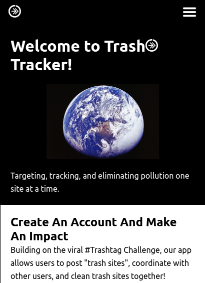
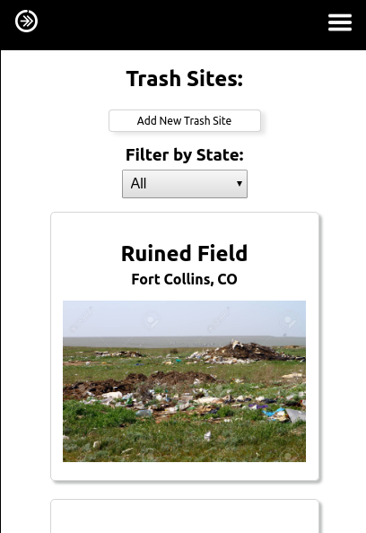
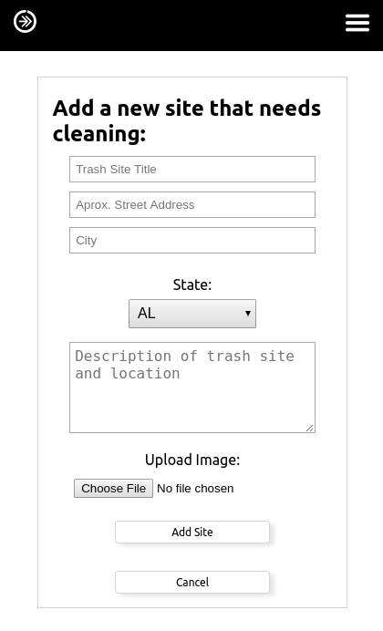
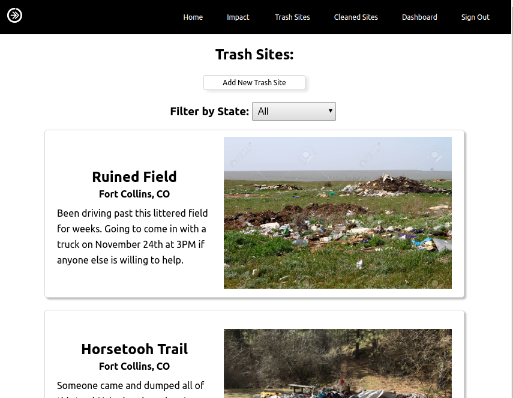
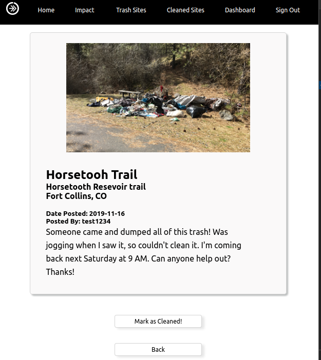
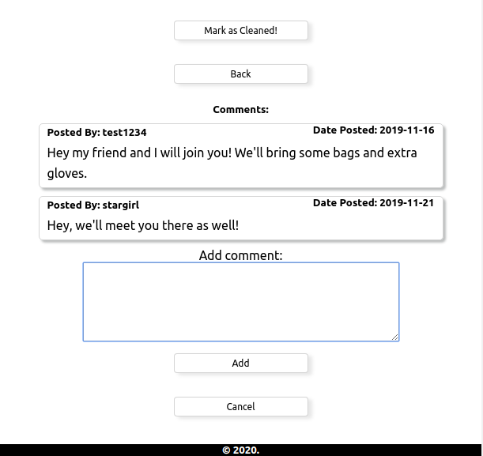

img[src*="#logo"]{
width: 150px;
height: 150px;
}

Trash#Tracker is an app designed to piggy-back off of the trending #Trash-Tag challenge. The challenge was to find an area that was littered or polluted, clean it, and then post a before and after picture of the clean up job.

This app allows users to post trash sites that need cleaning, communicate with other interested users, and then mark a site as cleaned and post a picture of their success.

Eventually the hope is that this app can measure the enviornmental impact of every user and suggest other ways that users can reduce their trash production and energy consumption.

# Approach

This is a mobile-first application with a focus on ease-of-use and intuitive user experience.

# Tech

- HTML
- CSS
- AOS Scrolling
- JavaScript
- React
- Enzyme

# APIs

1. [Trash-Tracker-API](https://github.com/Cosmic-Noir/trash-tracker-api)
   - Accompanying server built with express to securely store site and user data.
   - Utilized all endpoints.

# Features

- Allows user to create a peronal account.
- Users can then post new trash sites.
- Users can comment on existing trash or cleaned sites.
- Users can mark trash sites as cleaned with their success picture.
- Users can view basic Enviornmental Impact score.

# Demo

- [TrashTracker Live](https://trash-tag-tracker-app.cosmicnoir.now.sh/)

## ScreenShots

###### Mobile Home Screen

###### Mobile Trash Site List Screen

###### Mobile Add Trash Site Screen

###### Desktop Trash Site List Screen

###### Desktop Site Detail Screen

###### Desktop Add Comment Screen

